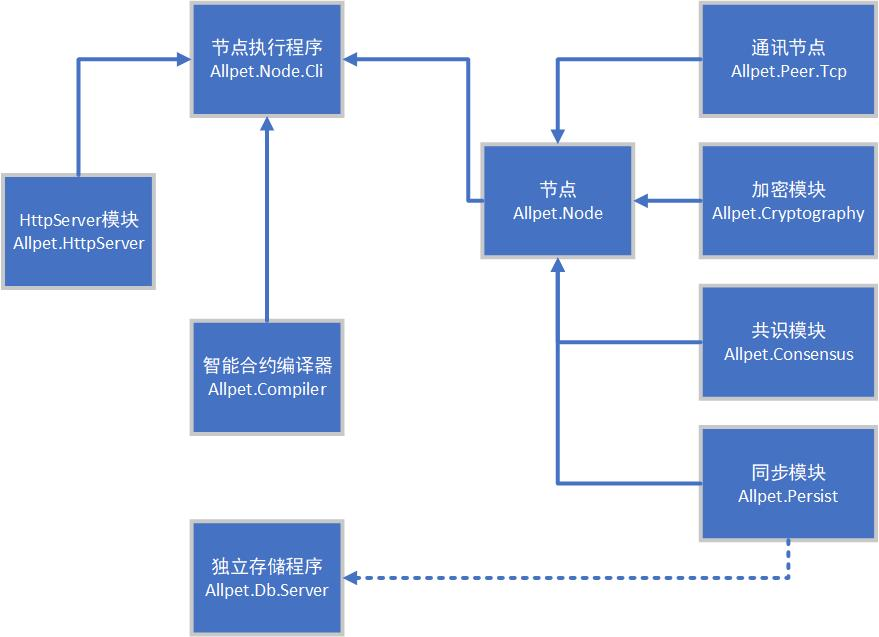

# abc 项目简介
abc=allpet block chain
是allpet项目得子项目，打造一个为allpet服务的区块链项目

该项目兼容NeoVM，根据NEO规则，这就属于NEO生态项目
该项目会使用部分NEO源代码，使用源代码时，均会附带License文件

该项目分为几个部分，模块化设计

项目可执行程序主要有两个
## 独立存储程序
独立存储程序即独立的一个数据库模块，来替代当前的本地leveldb。
将其独立开，为IO瓶颈的提升留下可能性，因为基于KeyValue数据库，很容易分片。

目前设计单链tps 在10k左右，第一瓶颈就会是存储。

另外将其独立开，不要求安全性的快速同步可以直接基于存储，而无需通过节点
## 节点执行程序
节点执行程序就是一个节点的启动程序，我们将整个ABC项目的功能都集中于节点之上

节点执行程序主要由 智能合约编译器，HttpServer模块，节点模块三个部分构成
### 智能合约编译器模块
将智能合约从 c# -> avm 的模块，该模块直接fork neo的 编译器，做稍微调整

neo的编译器、设置为一个独立运行程序、且依赖一个devpack 编译。
编译器、节点、devpack 三者有版本兼容关系，需一起更新。

吸收Neo的教训，我们将这三者集成于一处,减少因版本兼容犯错的机会
### HttpServer模块
提供Http服务的基础模块
### 节点模块
封装了节点逻辑的模块，单独从节点执行程序中剥离，是为了方便第三方集成节点
#### 通讯节点模块
专门处理连接的模块
#### 加密模块
专门提供加密解密算法的模块，兼容NEO的公私钥系统，并增加可扩展性，为对抗量子危机做好准备
#### 共识模块
专门提供共识逻辑的模块，设计为可插拔，可以方便的更换共识机制，变成不同形式的区块链系统
#### 同步模块
专门同步块数据，维护节点状态的模块，该模块主要功能是跑neovm和写入数据库